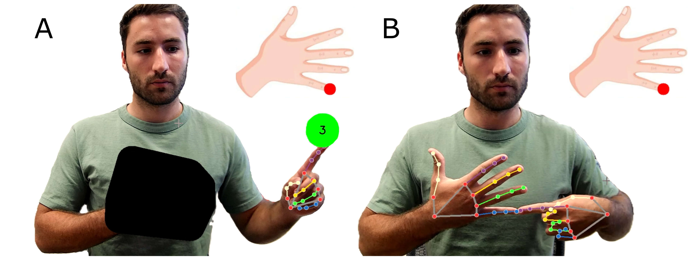
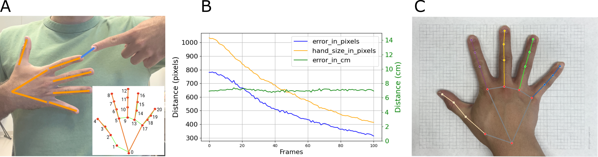

# OpenPoint

OpenPoint leverages computer vision for UE proprioceptive assessment.The basic idea of the OpenPoint proprioception assessment is to automate a finger-to-finger pointing task



Figure 1. The visual display of the OpenPoint proprioception assessment, as implemented with a webcam. A mirror-image, live video, obtained by a webcam, is shown to the subject.  (A): The subject rests their impaired hand (the "target hand") on their torso. MediaPipe tracks hand landmarks, and a polygon is used to obscure the target hand. The user raises their pointing finger to the green target. After a three-second countdown, the software displays a target on a cartoon fingertip. (B): After receiving the visual cue, the user points to the target fingertip. OpenPoint measures pointing error when the movement stops. Note: the polygon is removed in B to show tracking but remains present during actual use of the system, obscuring the target hand

## Installation
```bash
# Clone the repository
git clone https://github.com/gcornella/OpenPoint.git

# Navigate into the directory
cd OpenPoint

# (Optional) Create and activate a virtual environment
python -m venv venv
source venv/bin/activate  # On Windows use `.\venv\Scripts\activate`

# Install dependencies
pip install -r requirements.txt
```

## Normalization
Upload an image of your hand on a piece of paper (US letter size), then the code will extract your hand size.


MediaPipe returns the fingertip position as pixel coordinates, therefore, we developed a method to convert pointing error from pixels to centimeters using measured hand size. Specifically, we defined handsize_px as the sum of the distances between the hand landmarks returned by MediaPipe.


Figure 2. Pointing error calculation. (A): Example output from MediaPipe. The orange lines connect the landmarks returned by MediaPipe when the fingers are fully extended. We defined pointing error as the distance between the fingertips in the frontal plane (blue line). (B): Results from a simple experiment where the participants kept the distance between their fingers constant but moved their hands away from the camera by sliding backward on a rolling chair. The pixel-based pointing error (blue) decreased as the individual rolled back from the camera, as did apparent hand size, measured in pixels (orange line). The pixel-based pointing error (blue) has been multiplied by 6 to better show the decrease in distance. Dividing pixel-based pointing error by handsize_px produced a constant pointing error (green) that can be scaled to centimeters based on the calibration photos in C. (C): Example calibration photo of participant’s hand lying on top of graph paper in order to calculate handsize_cm.

## Assessment 
Choose a target hand, then run each code separately, specifying the user_id that will appear in a GUI input box.


## Results
Use this code to get the results from the assessment images

## Significance
Use this code to compare proprioceptive performance between users or the same user on different days.

## Contributing

Pull requests are welcome. For major changes, please open an issue first
to discuss what you would like to change.

Please make sure to update tests as appropriate.

## License

[MIT](https://choosealicense.com/licenses/mit/)
